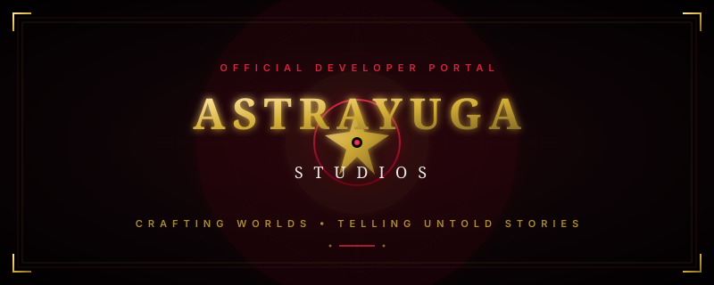
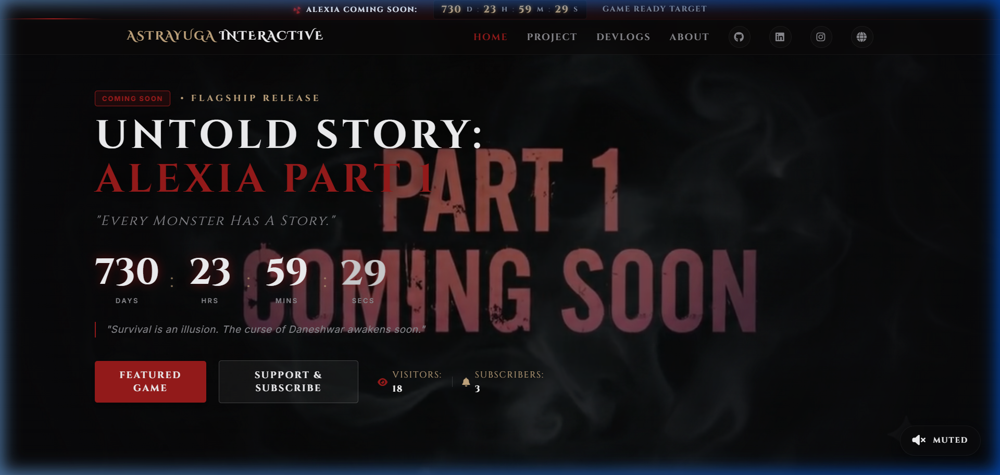

<div align="center">
  

  <br/>

  [](https://github.com/Shoubhik95)
  [](https://github.com/Shoubhik95)
  [](https://github.com/Shoubhik95)

  <p align="center">
    <strong>🌌 Crafting Worlds. Telling Untold Stories. 🌌</strong>
  </p>
  
  <p align="center">
    Welcome to the official developer portal repository of <strong>AstraYuga Studios</strong> — an independent game development studio focused on creating immersive worlds, deep atmospheric narratives, and unforgettable interactive horror experiences.
  </p>
</div>

---

## 🎮 About AstraYuga Studios

AstraYuga Studios is dedicated to designing premium indie gaming experiences that captivate players through rich lore and atmospheric depth. Our design core is built around five pillars:

```
┌────────────────────────────────────────────────────────┐
│                   ASTRAYUGA PILLARS                    │
├─────────────┬─────────────┬─────────────┬──────────────┤
│    🎭 Deep  │ 🎥 Cinematic│ 🌍 Immersive│ 🧩 Creative  │
│ Narrative   │ Experience  │  Game World │  Game Design │
└─────────────┴─────────────┴─────────────┴──────────────┘
```

- **🎭 Deep Storytelling**: Narrative-driven mechanics that challenge player choices.
- **🎥 Cinematic Experiences**: Immersive camera work, dramatic lighting, and chilling audio design.
- **🌍 Immersive Worlds**: Highly detailed environments designed to evoke psychological tension.
- **🧩 Creative Game Design**: Handcrafted puzzles, dynamic lighting overlays, and atmospheric menus.

---

## 🕯️ Featured Project: Untold Story (Part 1)

> *"Tum mere save file ke saath chhedchhad nahi kar sakti!"*
> 
> **Untold Story: Alexia** is a psychological horror experience where mystery, exploration, and sanity collide. Dive into a chilling narrative set in Vit Bhopal campus, developed single-handedly by Shoubhik Bhattacharya.

### Key Game Systems
- **Sanity Meter**: Your fear levels dynamically affect screen overlays and ambient sounds.
- **Real-Time Countdown**: Interactive 2-year release countdown integrated across the portal ticker, newswire card, and main landing pages.
- **Ambient Horror Audio Widget**: User-controlled ambient tracks and synchronized horror videos.
- **Horror Custom Cursor**: Interactive custom cursor leaving trail elements upon hovering over critical elements.

---

## 🌐 Website Features & Sections

| Section | Description | Key Tech / Features |
| :--- | :--- | :--- |
| **🏠 Home / Hero** | Cinematic introduction with auto-playing video & unmuted audio widget | 3D Calendar Countdown Flips |
| **🎮 Projects** | Showcase of flagship games including *Untold Story: Alexia* | Spotlight Accordions & GDD Tabs |
| **📰 Devlogs / Newswire** | Real-time countdown & development blog updates | Interactive progress tracker |
| **👥 About Studio** | Developer profile, vitals, and VIT Bhopal origins | IntersectionObserver scroll reveal |

---

## 🛠️ Tech Stack & Future Roadmap

### Active Stack
* **Markup & UI**: Semantic HTML5, Font Awesome v6 icons, custom Google Fonts (`Cinzel Decorative`, `Inter`, `Creepster`).
* **Styling**: Vanilla CSS3, custom volumetric fog overlay animations, horror theme glassmorphism.
* **Logic**: Vanilla ES6 JavaScript (Real-time storage for timers, mouse-tracking cursor trails, ambient controller).

### Roadmap
- [ ] Implement **Three.js** interactive 3D elements in the background.
- [ ] Embed interactive **Unreal Engine 5** web showcase.
- [ ] Set up a dynamic markdown-based Devlog CMS.
- [ ] Port the developer portal layout to a **Next.js** framework.

## 📸 Website Preview

<div align="center">
  
</div>

---

## 👨‍💻 Solo Developer

**Shoubhik Bhattacharya**  
*Founder & Solo Indie Game Developer at AstraYuga Studios*  
🎓 Student at **VIT Bhopal**

<p align="left">
  <a href="https://github.com/Shoubhik95" target="_blank"></a>
  <a href="https://www.linkedin.com/in/shoubhik-bhattacharya-8b4099324/" target="_blank"></a>
  <a href="https://www.instagram.com/shouvik_cinematics_08?utm_source=qr&igsh=MXcxd3o3NGU5ZDAydQ==" target="_blank"></a>
</p>

---

<div align="center">
  <p>Copyright © AstraYuga Studios. All Rights Reserved.</p>
</div>
